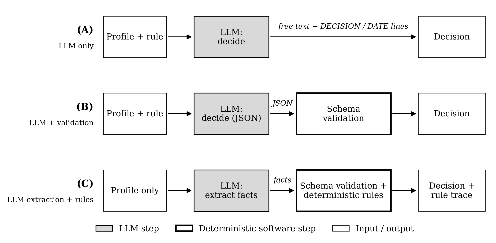
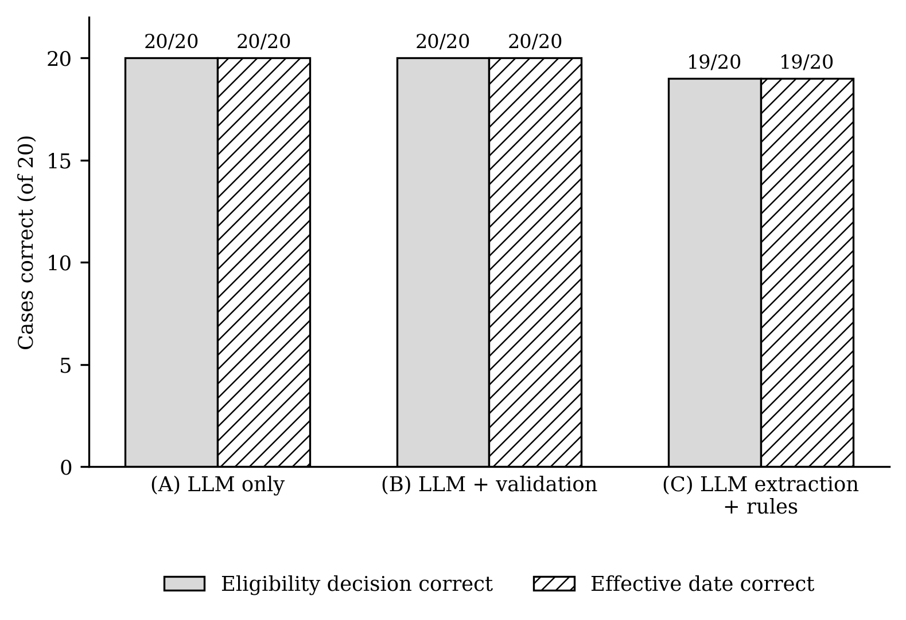
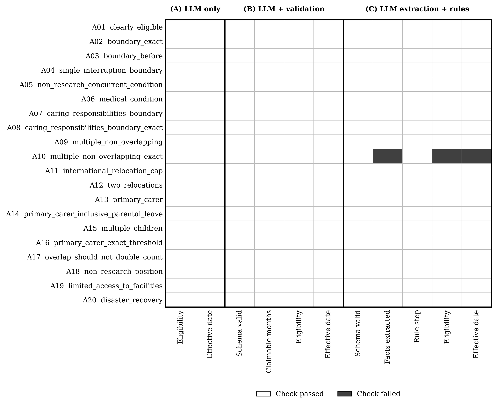

# The Decision Boundary.

**An Exploratory Evaluation of LLM Autonomy in Research-Funding Eligibility Workflows**

A small, controlled experiment that compares three ways of dividing an eligibility decision between a large language model (LLM) and deterministic software, and examines what each design gets right, where it fails, and what it leaves behind for audit.

## Research Question

> How does the allocation of decision-making between an LLM and deterministic software affect the accuracy and auditability of research-funding eligibility assessment?

## Hypothesis

The study is exploratory; no hypotheses were pre-registered. The design was guided by three working expectations:

- **H1 (accuracy).** When the LLM applies the rule itself (A, B), it will make more rule-application errors on cases with caps, concurrency conditions or nested parental leave than when deterministic code applies the rule (C).
- **H2 (validity).** A JSON schema (B) will produce machine-readable output, but schema validity alone will not guarantee a correct decision.
- **H3 (auditability).** Only structured facts combined with deterministic rules (C) will let each decision be recomputed and each error be traced to a specific input or rule step.

## Experiment



All three architectures use the same model and the same applicant profiles. The architecture code calls a provider-independent client (`src/llm_client.py`), never a specific provider directly.

### Architecture A — LLM-only

`Applicant profile + rule → LLM → decision`

The model explains its reasoning briefly and ends with `DECISION: ELIGIBLE|INELIGIBLE` and `EFFECTIVE_DATE: YYYY-MM-DD` lines, which are parsed.

### Architecture B — LLM + Validation

`Applicant profile + rule → LLM → JSON → schema validation → decision`

The model returns `eligible`, `effective_eligibility_date`, `claimable_interruption_months` and `reasoning`. A strict Pydantic schema checks the output. The model still makes the decision.

### Architecture C — LLM Extraction + Deterministic Rules

`Applicant profile → LLM → extracted facts (JSON) → schema validation → Python rule engine → decision + rule trace`

The model is told it is *"an information extraction component"* and must not determine eligibility. It does not see the rule. It returns the PhD award date and a list of interruptions with their types, durations and attributes. `src/rules.py` then computes the claimable months, effective date and decision, and records a step-by-step trace.

## Dataset

- **20 synthetic applicant profiles (A01–A20).** They cover clear cases, exact and one-day boundary cases, single and multiple interruptions, a concurrent non-research position, relocation caps, primary-carer periods with and without parental leave, and two sequential primary-carer periods.
- **Source of truth:** `data/20_applicant_cases.md`. `src/prepare_data.py` turns it into two separate files:
  - `data/applicants.json` contains only `id` and `profile`. It is the only applicant data a model can receive.
  - `data/ground_truth.json` contains the expected eligibility, effective date, claimable months, category and reason. It is used **only** by `src/evaluation.py`, after all predictions exist.
- **Ground truth** was established manually before any model was run. Profiles were edited beforehand to remove wording that revealed the answer or explained the rule.
- **Leakage checks:**
  - `prepare_data.py` checks that no ground-truth field or answer wording appears in any profile.
  - `src/leakage_check.py` checks each smoke-test prompt for that applicant's expected values before the call is made.
  - No LLM-facing module (`llm_client.py`, `prompts.py`, `architectures.py`, `rules.py`) reads `ground_truth.json`.

**Eligibility rule** (`data/eligibility_rule.md`): an applicant is eligible if their PhD award date, extended by allowable career interruptions after the PhD, is on or after **1 March 2021**. This is a simplified adaptation of the [ARC Eligibility and Career Interruptions Statement](https://www.arc.gov.au/sites/default/files/2024-03/Eligibility%20and%20Career%20Interruptions%20Statement.pdf), not the official policy text. The official DECRA criterion is stated as a period from PhD conferral; this study fixes it as a single threshold date.

## Evaluation

| Metric | Definition |
|---|---|
| Eligibility accuracy | Predicted eligibility matches ground truth (out of 20; a failed call counts as incorrect) |
| Effective-date accuracy | Predicted effective date matches ground truth |
| Output / schema validity | A: decision line parsed; B: JSON passed the decision schema; C: JSON passed the facts schema |
| Internal consistency (A, B) | The stated decision agrees with the model's own effective date; for B, PhD date + claimed months = stated date |
| Fact extraction accuracy (C) | PhD date, interruption types and durations, and attributes all correct, with no unsupported attributes |
| Replayability (C) | Re-running the rule engine on the logged facts reproduces the logged decision, date and trace exactly |
| Error category | Assigned to each disagreement, separating LLM extraction errors from rule-application errors |

Full definitions are in the docstring of `src/evaluation.py`.

## Results

The single run: model `openai/gpt-oss-20b` via Groq, temperature 0, 60 calls (20 applicants × 3 architectures). All 60 calls completed; there were no API, parsing or schema failures.

| Architecture | Eligibility | Effective date | Output / schema valid | Fact extraction | Decision replayable from log |
|---|---|---|---|---|---|
| A — LLM only | 20/20 | 20/20 | 20/20 | — | No |
| B — LLM + validation | 20/20 | 20/20 | 20/20 | — | No |
| C — LLM extraction + rules | 19/20 | 19/20 | 20/20 | 19/20 | 20/20 |



**The only error (A10, Architecture C)** came from fact extraction, not from the rule engine:
- **Invented attribute:** the extractor marked a 7-month parental-leave period as `within_primary_carer_period = true`, although the profile mentions no primary-carer period.
- **Correct rule application:** the rule engine applied that input as the rule specifies and counted the leave as 0 months.
- **Effect:** the effective date became 2020-08-15 instead of 2021-03-15, and the applicant was predicted ineligible.
- **Detection:** the pipeline did not flag the error at runtime. Once it was found, the log traced it to one field and one rule step.



**Interpretation, within the limits of this experiment:**
- **Accuracy:** it did not meaningfully separate the architectures. A and B reached the ceiling, so the dataset may be too easy to discriminate between them.
- **Auditability:** this is where the architectures differed. Only C allows every decision to be recomputed and its one error to be localised.
- **Scope:** these are descriptive results from 20 synthetic cases, one model and one run. They do not support claims of general superiority, statistical significance, or applicability to real research administration.

## Research Paper

The full write-up is in [`paper/Reserach_Analysis_Paper.docx`](paper/Reserach_Analysis_Paper.docx).

## Configuration

Copy `.env.example` to `.env` in the project root and set the variables below. `.env` is git-ignored and must never be committed.

| Variable | Purpose |
|---|---|
| `LLM_MODE` | `mock` (default; no API calls) or `groq` (real Groq API calls) |
| `GROQ_API_KEY` | Groq API key; required when `LLM_MODE=groq` |
| `GROQ_MODEL` | Groq model ID used by all three architectures; required when `LLM_MODE=groq`. See [Groq models](https://console.groq.com/docs/models). The reported run used `openai/gpt-oss-20b`. |

## Reproducing

Requires Python 3.10 or later.

```bash
pip install -r requirements.txt

# 1. Regenerate applicants.json and ground_truth.json from the Markdown cases, and run the leakage checks
python src/prepare_data.py

# 2. Smoke test: one applicant through one architecture (checks the prompt for leakage before calling)
python src/run_experiment.py --applicant A01 --architecture C

# 3. Full experiment: 20 applicants x 3 architectures (only runs with --all; the reported run used --delay 4)
python src/run_experiment.py --all --delay 4

# 4. Evaluate the latest Groq run against ground truth
python src/evaluation.py

# 5. Redraw the figures from the evaluation outputs
python src/make_figures.py
```

Steps 1, 4 and 5 make no API calls. With `LLM_MODE=mock`, steps 2 and 3 return fixed placeholder responses and make no API calls either. A full mock run writes to `results/raw_results_mock.csv`, which is git-ignored.

To re-evaluate the reported run without calling any model, run step 4 only: `python src/evaluation.py --run-id 20261003T032528Z-6eba21`.

## Project Structure

```
├── data/
│   ├── 20_applicant_cases.md      source dataset: 20 cases with ground truth
│   ├── applicants.json            LLM input: id + profile only
│   ├── ground_truth.json          evaluation only; never sent to a model
│   └── eligibility_rule.md        rule text given to Architectures A and B
├── src/
│   ├── prepare_data.py            builds the two JSON files from the Markdown, with leakage checks
│   ├── llm_client.py              LLMClient interface, Groq client and mock client
│   ├── prompts.py                 versioned prompt templates for A, B and C
│   ├── architectures.py           the three architecture entry points
│   ├── rules.py                   deterministic rule engine with step-by-step trace
│   ├── leakage_check.py           pre-call check that a prompt contains no ground-truth values
│   ├── run_experiment.py          smoke test and full run; logs every call
│   ├── evaluation.py              scores predictions against ground truth
│   └── make_figures.py            draws the figures from the results
├── results/
│   ├── raw_results.csv            every call in the reported run: prompt, raw response, parsed output, rule trace
│   ├── smoke_test.csv             pre-experiment smoke test (A01 through A, B and C)
│   ├── evaluation_summary.csv     metrics per architecture
│   ├── evaluation_details.csv     every prediction, scored
│   ├── error_analysis.csv         predictions that disagree with ground truth
│   └── error_pattern_matrix.csv   pass/fail of each pipeline stage per applicant
├── figures/                       architecture diagram, accuracy chart, error-pattern matrix
├── paper/                         research paper
├── .env.example                   configuration template
└── requirements.txt
```
